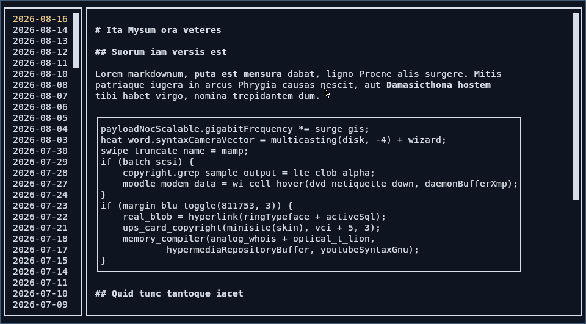

# TIL - Today I Log



`til` is a TUI for a markdown logbook/diary.

## Run

```shell
nix run github:damianfral/til
```

### Options

```text
til v1.0.0

Usage: til [--directory STRING] [--editor STRING]

Available options:
  -h,--help                Show this help text
  --directory STRING       Log directory (default: "./")
  --editor STRING          Editor to open markdown files (default: "vi")
```

### Keybindings

| Keybinding | Description |
| ---------- | ----------- |
| `Esc` / `q` | exit |
| `h` | help |
| `r` | refresh current entry |
| `J` / `Ctrl+p` | select day before |
| `K` / `Ctrl+n` | select day after |
| `j` / `PageDown` | scroll down |
| `k` / `PageUp` | scroll up |
| `e` | edit entry |

## Home Manager module

```nix
home-manager.users.my-user = {
  imports = [inputs.til.homeManagerModules.default];
  programs.til.enable = true;
  programs.til.directory = "~/code/journal";
  programs.til.editor = "nvim";
}
```
